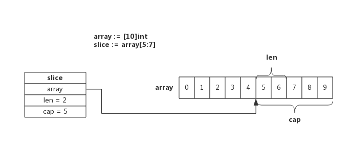
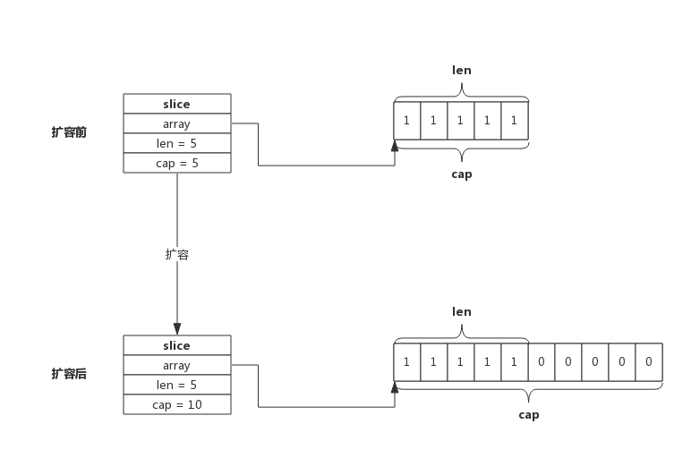

# golang常见的数据结构实现原理
## 1. chan
   channel是Golang在语言层面提供的goroutine间的通信方式，比Unix管道更易用也更轻便。channel主要用于进程内各goroutine间通信，如果需要跨进程通信，建议使用分布式系统的方法来解决。

## 1.1 chan数据结构
###  1.1.1 src/runtime/chan.go:hchan定义了channel的数据结构：

  type hchan struct {  
    &emsp; qcount   uint               &emsp;&emsp;&emsp;&emsp;  // 当前队列中剩余元素个数  
    &emsp; dataqsiz uint               &emsp;&emsp;&emsp;&emsp;  // 环形队列长度，即可以存放的元素个数  
    &emsp; buf      unsafe.Pointer     &emsp;&emsp;&emsp;&emsp;  // 环形队列指针  
    &emsp; elemsize uint16             &emsp;&emsp;&emsp;&emsp;  // 每个元素的大小  
    &emsp; closed   uint32             &emsp;&emsp;&emsp;&emsp;  // 标识关闭状态  
    &emsp; elemtype *_type             &emsp;&emsp;&emsp;&emsp;  // 元素类型  
    &emsp; sendx    uint               &emsp;&emsp;&emsp;&emsp;  // 队列下标，指示元素写入时存放到队列中的位置  
    &emsp; recvx    uint               &emsp;&emsp;&emsp;&emsp;  // 队列下标，指示元素从队列的该位置读出  
    &emsp; recvq    waitq              &emsp;&emsp;&emsp;&emsp;  // 等待读消息的goroutine队列  
    &emsp; sendq    waitq              &emsp;&emsp;&emsp;&emsp;  // 等待写消息的goroutine队列  
    &emsp; lock mutex                  &emsp;&emsp;&emsp;&emsp;  // 互斥锁，chan不允许并发读写  
 }

### 1.1.2  环形队列
   chan内部实现了一个环形队列作为其缓冲区，队列的长度是创建chan时指定的。通过make(chan int,number)

   下图展示了一个可缓存6个元素的channel示意图：
    

    dataqsiz指示了队列长度为6，即可缓存6个元素；  
    buf指向队列的内存，队列中还剩余两个元素；  
    qcount表示队列中还有两个元素；  
    sendx指示后续写入的数据存储的位置，取值[0, 6)；  
    recvx指示从该位置读取数据, 取值[0, 6)；  

### 1.1.3  等待队列
   从channel读数据，如果channel缓冲区为空或者没有缓冲区，当前goroutine会被阻塞。向channel写数据，如果channel缓冲区已满或者没有缓冲区，当前goroutine会被阻塞。  

   被阻塞的goroutine将会挂在channel的等待队列中：  
     因读阻塞的goroutine会被向channel写入数据的goroutine唤醒；  
     因写阻塞的goroutine会被从channel读数据的goroutine唤醒；  

   下图展示了一个没有缓冲区的channel，有几个goroutine阻塞等待读数据： 
    

   注意，一般情况下recvq和sendq至少有一个为空。只有一个例外，那就是同一个goroutine使用select语句向channel一边写数据，一边读数据。

### 1.1.4  等待队列
   一个channel只能传递一种类型的值，类型信息存储在hchan数据结构中。  

   elemtype代表类型，用于数据传递过程中的赋值；  
   elemsize代表类型大小，用于在buf中定位元素位置。   

### 1.1.5  锁
   一个channel同时仅允许被一个goroutine读写  

### 1.1.6 向channel写数据
   向一个channel中写数据简单过程如下：  
     1.如果等待接收队列recvq不为空，说明缓冲区中没有数据或者没有缓冲区，此时直接从recvq取出G,并把数据写入，最后把该G唤醒，结束发送过程；  
     2.如果缓冲区中有空余位置，将数据写入缓冲区，结束发送过程；  
     3.如果缓冲区中没有空余位置，将待发送数据写入G，将当前G加入sendq，进入睡眠，等待被读goroutine唤醒；  

     简单流程图如下：
    

### 1.1.7 从channel读数据
   从一个channel读数据简单过程如下：    
     1.如果等待发送队列sendq不为空，且没有缓冲区，直接从sendq中取出G，把G中数据读出，最后把G唤醒，结束读取过程；  
     2.如果等待发送队列sendq不为空，此时说明缓冲区已满，从缓冲区中首部读出数据，把G中数据写入缓冲区尾部，把G唤醒，结束读取过程；  
     3.如果缓冲区中有数据，则从缓冲区取出数据，结束读取过程；  
     4.将当前goroutine加入recvq，进入睡眠，等待被写goroutine唤醒；  

    简单流程图如下：  
    

### 1.1.8 关闭channel
   关闭channel时会把recvq中的G全部唤醒，本该写入G的数据位置为nil。把sendq中的G全部唤醒，但这些G会panic。  
   除此之外，panic出现的常见场景还有：  
     1.关闭值为nil的channel  
     2.关闭已经被关闭的channel  
     3.向已经关闭的channel写数据   

### 1.1.9 单向channel 
    单向channel指只能用于发送或接收数据,实际上也没有单向channel。  
    我们知道channel可以通过参数传递，所谓单向channel只是对channel的一种使用限制， 

     func readChan(chanName <-chan int)： 通过形参限定函数内部只能从channel中读取数据    
     func writeChan(chanName chan<- int)： 通过形参限定函数内部只能向channel中写入数据

### 1.1.10 select 
   使用select可以监控多channel，比如监控多个channel，当其中某一个channel有数据时，就从其读出数据。从channel中读出数据的顺序是随机的，事实上select语句的多个case执行顺序是随机的  

### 1.1.11 range   
   通过range可以持续从channel中读出数据，好像在遍历一个数组一样，当channel中没有数据时会阻塞当前goroutine，与读channel时阻塞处理机制一样。  
   注意：如果向此channel写数据的goroutine退出时，系统检测到这种情况后会panic，否则range将会永久阻塞。      

## 2. slice
  Slice又称动态数组，依托数组实现，可以方便的进行扩容、传递等，实际使用中比数组更灵活。  

### 2.1 Slice实现原理  
  Slice依托数组实现，底层数组对用户屏蔽，在底层数组容量不足时可以实现自动重分配并生成新的Slice。接下来按照实际使用场景分别介绍其实现机制。

### 2.2 Slice数据结构
  源码包中src/runtime/slice.go:slice定义了Slice的数据结构：  
    type slice struct {  
      array unsafe.Pointer  
      len   int  
      cap   int  
    }  

  从数据结构看Slice很清晰, array指针指向底层数组，len表示切片长度，cap表示底层数组容量。

### 2.3 使用make创建Slice
   使用make来创建Slice时，可以同时指定长度和容量，创建时底层会分配一个数组，数组的长度即容量。    
   例如，语句slice := make([]int, 5, 10)所创建的Slice，结构如下图所示：
    

   该Slice长度为5，即可以使用下标slice[0] ~ slice[4]来操作里面的元素，capacity为10，表示后续向slice添加新的元素时可以不必重新分配内存，直接使用预留内存即可。  

### 2.4 使用数组创建Slice
  使用数组来创建Slice时，Slice将与原数组共用一部分内存。  
  例如，语句slice := array[5:7]所创建的Slice，结构如下图所示： 
    
   切片从数组array[5]开始，到数组array[7]结束（不含array[7]），即切片长度为2，数组后面的内容都作为切片的预留内存，即capacity为5。  

### 2.5 Slice 扩容
  使用append向Slice追加元素时，如果Slice空间不足，将会触发Slice扩容，扩容实际上重新一配一块更大的内存，将原Slice数据拷贝进新Slice，然后返回新Slice，扩容后再将数据追加进去。  

  例如，当向一个capacity为5，且length也为5的Slice再次追加1个元素时，就会发生扩容，如下图所示：
      
   扩容操作只关心容量，会把原Slice数据拷贝到新Slice，追加数据由append在扩容结束后完成。上图可见，扩容后新的Slice长度仍然是5，但容量由5提升到了10，原Slice的数据也都拷贝到了新Slice指向的数组中。  

   扩容容量的选择遵循以下规则：
    如果原Slice容量小于1024，则新Slice容量将扩大为原来的2倍；  
    如果原Slice容量大于等于1024，则新Slice容量将扩大为原来的1.25倍；  
   
   使用append()向Slice添加一个元素的实现步骤如下：  
     1.假如Slice容量够用，则将新元素追加进去，Slice.len++，返回原Slice   
     2.原Slice容量不够，则将Slice先扩容，扩容后得到新Slice  
     3.将新元素追加进新Slice，Slice.len++，返回新的Slice。 

### 2.6 Slice Copy  
    使用copy()内置函数拷贝两个切片时，会将源切片的数据逐个拷贝到目的切片指向的数组中，拷贝数量取两个切片长度的最小值。  
    例如长度为10的切片拷贝到长度为5的切片时，将会拷贝5个元素。  
    也就是说，copy过程中不会发生扩容。 

### 2.7 Slice总结 
    1.每个切片都指向一个底层数组  
    2.每个切片都保存了当前切片的长度、底层数组可用容量  
    3.使用len()计算切片长度时间复杂度为O(1)，不需要遍历切片  
    4.使用cap()计算切片容量时间复杂度为O(1)，不需要遍历切片    
    5.通过函数传递切片时，不会拷贝整个切片，因为切片本身只是个结构体而矣  
    6.使用append()向切片追加元素时有可能触发扩容，扩容后将会生成新的切片

## 3.map数据结构   
   Golang的map使用哈希表作为底层实现，一个哈希表里可以有多个哈希表节点，也即bucket，而每个bucket就保存了map中的一个或一组键值对。  

### 3.1 map数据结构由runtime/map.go/hmap定义:    
    type hmap struct {  
        count     int // 当前保存的元素个数  
        ...
        B         uint8  // 指示bucket数组的大小  
        ...
        buckets    unsafe.Pointer // bucket数组指针，数组的大小为2^B  
        ...
   }   

   下图展示一个拥有4个bucket的map：  
        

   本例中, hmap.B=2， 而hmap.buckets长度是2^B为4. 元素经过哈希运算后会落到某个bucket中进行存储。查找过程类似。   
   bucket很多时候被翻译为桶，所谓的哈希桶实际上就是bucket。  

### 3.2 bucket数据结构  
   bucket数据结构由runtime/map.go/bmap定义：   
   type bmap struct {  
        tophash [8]uint8 //存储哈希值的高8位  
        data    byte[1]  //key value数据:key/key/key/.../value/value/value...  
        overflow *bmap   //溢出bucket的地址   
   }

   每个bucket可以存储8个键值对。
    tophash是个长度为8的数组，哈希值相同的键（准确的说是哈希值低位相同的键）存入当前bucket时会将哈希值的高位存储在该数组中，以方便后续匹配。
    data区存放的是key-value数据，存放顺序是key/key/key/…value/value/value，如此存放是为了节省字节对齐带来的空间浪费。  
    overflow 指针指向的是下一个bucket，据此将所有冲突的键连接起来。    

    注意：上述中data和overflow并不是在结构体中显示定义的，而是直接通过指针运算进行访问的  

    下图展示bucket存放8个key-value对：
     

### 3.3 哈希冲突 
    当有两个或以上数量的键被哈希到了同一个bucket时，我们称这些键发生了冲突。Go使用链地址法来解决键冲突。由于每个bucket可以存放8个键值对，所以同一个bucket存放超过8个键值对时就会再创建一个键值对，用类似链表的方式将bucket连接起来  

    下图展示产生冲突后的map：
     
   bucket数据结构指示下一个bucket的指针称为overflow bucket，意为当前bucket盛不下而溢出的部分。事实上哈希冲突并不是好事情，它降低了存取效率，好的哈希算法可以保证哈希值的随机性，但冲突过多也是要控制的 

### 3.4 负载因子  
   负载因子用于衡量一个哈希表冲突情况，公式为：
     负载因子 = 键数量/bucket数量

   例如，对于一个bucket数量为4，包含4个键值对的哈希表来说，这个哈希表的负载因子为1.

   哈希表需要将负载因子控制在合适的大小，超过其阀值需要进行rehash，也即键值对重新组织：  
     哈希因子过小，说明空间利用率低  
     哈希因子过大，说明冲突严重，存取效率低   

   每个哈希表的实现对负载因子容忍程度不同，比如Redis实现中负载因子大于1时就会触发rehash，而Go则在在负载因子达到6.5时才会触发rehash，因为Redis的每个bucket只能存1个键值对，而Go的bucket可能存8个键值对，所以Go可以容忍更高的负载因子。

### 3.5 渐进式扩容  
####  3.5.1 扩容的前提条件
    为了保证访问效率，当新元素将要添加进map时，都会检查是否需要扩容，扩容实际上是以空间换时间的手段。触发扩容的条件有二个：  
      负载因子 > 6.5时，也即平均每个bucket存储的键值对达到6.5个。   
      overflow数量 > 2^15时，也即overflow数量超过32768时。   

####  3.5.2 增量扩容
    当负载因子过大时，就新建一个bucket，新的bucket长度是原来的2倍，然后旧bucket数据搬迁到新的bucket。考虑到如果map存储了数以亿计的key-value，一次性搬迁将会造成比较大的延时，Go采用逐步搬迁策略，即每次访问map时都会触发一次搬迁，每次搬迁2个键值对。  

    下图展示了包含一个bucket满载的map(为了描述方便，图中bucket省略了value区域): 
    

   当前map存储了7个键值对，只有1个bucket。此地负载因子为7。再次插入数据时将会触发扩容操作，扩容之后再将新插入键写入新的bucket。   

   当第8个键值对插入时，将会触发扩容，扩容后示意图如下：
    

   hmap数据结构中oldbuckets成员指身原bucket，而buckets指向了新申请的bucket。新的键值对被插入新的bucket中。后续对map的访问操作会触发迁移，将oldbuckets中的键值对逐步的搬迁过来。当oldbuckets中的键值对全部搬迁完毕后，删除oldbuckets。  

   搬迁完成后的示意图如下：  
   

   数据搬迁过程中原bucket中的键值对将存在于新bucket的前面，新插入的键值对将存在于新bucket的后面  

####  3.5.3 等量扩容 
    所谓等量扩容，实际上并不是扩大容量，buckets数量不变，重新做一遍类似增量扩容的搬迁动作，把松散的键值对重新排列一次，以使bucket的使用率更高，进而保证更快的存取。在极端场景下，比如不断的增删，而键值对正好集中在一小部分的bucket，这样会造成overflow的bucket数量增多，但负载因子又不高，从而无法执行增量搬迁的情况，如下图所示：
    

   上图可见，overflow的buckt中大部分是空的，访问效率会很差。此时进行一次等量扩容，即buckets数量不变，经过重新组织后overflow的bucket数量会减少，即节省了空间又会提高访问效率。  

###  3.6 查找过程
    查找过程如下：  
     1.跟据key值算出哈希值  
     2.取哈希值低位与hmpa.B取模确定bucket位置  
     3.取哈希值高位在tophash数组中查询  
     4.如果tophash[i]中存储值也哈希值相等，则去找到该bucket中的key值进行比较  
     5.当前bucket没有找到，则继续从下个overflow的bucket中查找。  
     6.如果当前处于搬迁过程，则优先从oldbuckets查找  

    注：如果查找不到，也不会返回空值，而是返回相应类型的0值。

###  3.7 插入过程
    新员素插入过程如下：
    1.跟据key值算出哈希值  
    2.取哈希值低位与hmap.B取模确定bucket位置  
    3.查找该key是否已经存在，如果存在则直接更新值  
    4.如果没找到将key，将key插入  

  

