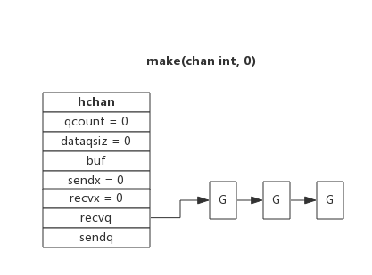
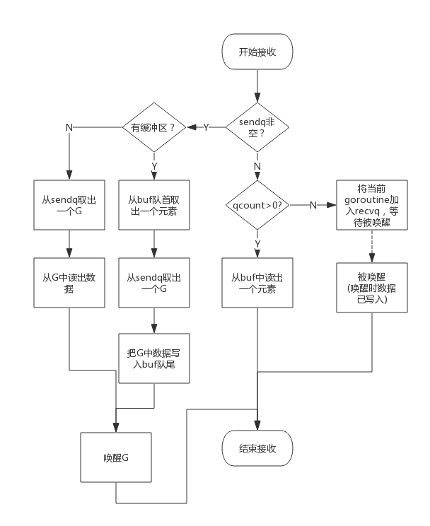

# golang常见的数据结构实现原理
## 1. chan
   channel是Golang在语言层面提供的goroutine间的通信方式，比Unix管道更易用也更轻便。channel主要用于进程内各goroutine间通信，如果需要跨进程通信，建议使用分布式系统的方法来解决。

## 1.1 chan数据结构
###  1.1.1 src/runtime/chan.go:hchan定义了channel的数据结构：

  type hchan struct {  
    &emsp; qcount   uint               &emsp;&emsp;&emsp;&emsp;  // 当前队列中剩余元素个数  
    &emsp; dataqsiz uint               &emsp;&emsp;&emsp;&emsp;  // 环形队列长度，即可以存放的元素个数  
    &emsp; buf      unsafe.Pointer     &emsp;&emsp;&emsp;&emsp;  // 环形队列指针  
    &emsp; elemsize uint16             &emsp;&emsp;&emsp;&emsp;  // 每个元素的大小  
    &emsp; closed   uint32             &emsp;&emsp;&emsp;&emsp;  // 标识关闭状态  
    &emsp; elemtype *_type             &emsp;&emsp;&emsp;&emsp;  // 元素类型  
    &emsp; sendx    uint               &emsp;&emsp;&emsp;&emsp;  // 队列下标，指示元素写入时存放到队列中的位置  
    &emsp; recvx    uint               &emsp;&emsp;&emsp;&emsp;  // 队列下标，指示元素从队列的该位置读出  
    &emsp; recvq    waitq              &emsp;&emsp;&emsp;&emsp;  // 等待读消息的goroutine队列  
    &emsp; sendq    waitq              &emsp;&emsp;&emsp;&emsp;  // 等待写消息的goroutine队列  
    &emsp; lock mutex                  &emsp;&emsp;&emsp;&emsp;  // 互斥锁，chan不允许并发读写  
 }

### 1.1.2  环形队列
   chan内部实现了一个环形队列作为其缓冲区，队列的长度是创建chan时指定的。通过make(chan int,number)

   下图展示了一个可缓存6个元素的channel示意图：
    

    dataqsiz指示了队列长度为6，即可缓存6个元素；  
    buf指向队列的内存，队列中还剩余两个元素；  
    qcount表示队列中还有两个元素；  
    sendx指示后续写入的数据存储的位置，取值[0, 6)；  
    recvx指示从该位置读取数据, 取值[0, 6)；  

### 1.1.3  等待队列
   从channel读数据，如果channel缓冲区为空或者没有缓冲区，当前goroutine会被阻塞。向channel写数据，如果channel缓冲区已满或者没有缓冲区，当前goroutine会被阻塞。  

   被阻塞的goroutine将会挂在channel的等待队列中：  
     因读阻塞的goroutine会被向channel写入数据的goroutine唤醒；  
     因写阻塞的goroutine会被从channel读数据的goroutine唤醒；  

   下图展示了一个没有缓冲区的channel，有几个goroutine阻塞等待读数据： 
    

   注意，一般情况下recvq和sendq至少有一个为空。只有一个例外，那就是同一个goroutine使用select语句向channel一边写数据，一边读数据。

### 1.1.4  等待队列
   一个channel只能传递一种类型的值，类型信息存储在hchan数据结构中。  

   elemtype代表类型，用于数据传递过程中的赋值；  
   elemsize代表类型大小，用于在buf中定位元素位置。   

### 1.1.5  锁
   一个channel同时仅允许被一个goroutine读写  

### 1.1.6 向channel写数据
   向一个channel中写数据简单过程如下：  
     1.如果等待接收队列recvq不为空，说明缓冲区中没有数据或者没有缓冲区，此时直接从recvq取出G,并把数据写入，最后把该G唤醒，结束发送过程；  
     2.如果缓冲区中有空余位置，将数据写入缓冲区，结束发送过程；  
     3.如果缓冲区中没有空余位置，将待发送数据写入G，将当前G加入sendq，进入睡眠，等待被读goroutine唤醒；  

     简单流程图如下：
    

### 1.1.7 从channel读数据
   从一个channel读数据简单过程如下：    
     1.如果等待发送队列sendq不为空，且没有缓冲区，直接从sendq中取出G，把G中数据读出，最后把G唤醒，结束读取过程；  
     2.如果等待发送队列sendq不为空，此时说明缓冲区已满，从缓冲区中首部读出数据，把G中数据写入缓冲区尾部，把G唤醒，结束读取过程；  
     3.如果缓冲区中有数据，则从缓冲区取出数据，结束读取过程；  
     4.将当前goroutine加入recvq，进入睡眠，等待被写goroutine唤醒；  

    简单流程图如下：  
    

### 1.1.8 关闭channel
   关闭channel时会把recvq中的G全部唤醒，本该写入G的数据位置为nil。把sendq中的G全部唤醒，但这些G会panic。  
   除此之外，panic出现的常见场景还有：  
     1.关闭值为nil的channel  
     2.关闭已经被关闭的channel  
     3.向已经关闭的channel写数据   

### 1.1.9 单向channel 
    单向channel指只能用于发送或接收数据,实际上也没有单向channel。  
    我们知道channel可以通过参数传递，所谓单向channel只是对channel的一种使用限制， 

     func readChan(chanName <-chan int)： 通过形参限定函数内部只能从channel中读取数据    
     func writeChan(chanName chan<- int)： 通过形参限定函数内部只能向channel中写入数据

### 1.1.10 select 
    使用select可以监控多channel，比如监控多个channel，当其中某一个channel有数据时，就从其读出数据。从channel中读出数据的顺序是随机的，事实上select语句的多个case执行顺序是随机的  

### 1.1.11 range   
    通过range可以持续从channel中读出数据，好像在遍历一个数组一样，当channel中没有数据时会阻塞当前goroutine，与读channel时阻塞处理机制一样。  
    注意：如果向此channel写数据的goroutine退出时，系统检测到这种情况后会panic，否则range将会永久阻塞。      
